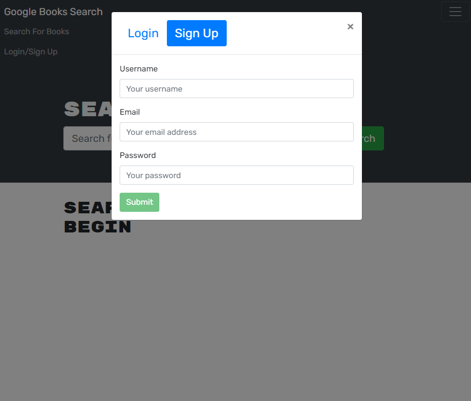
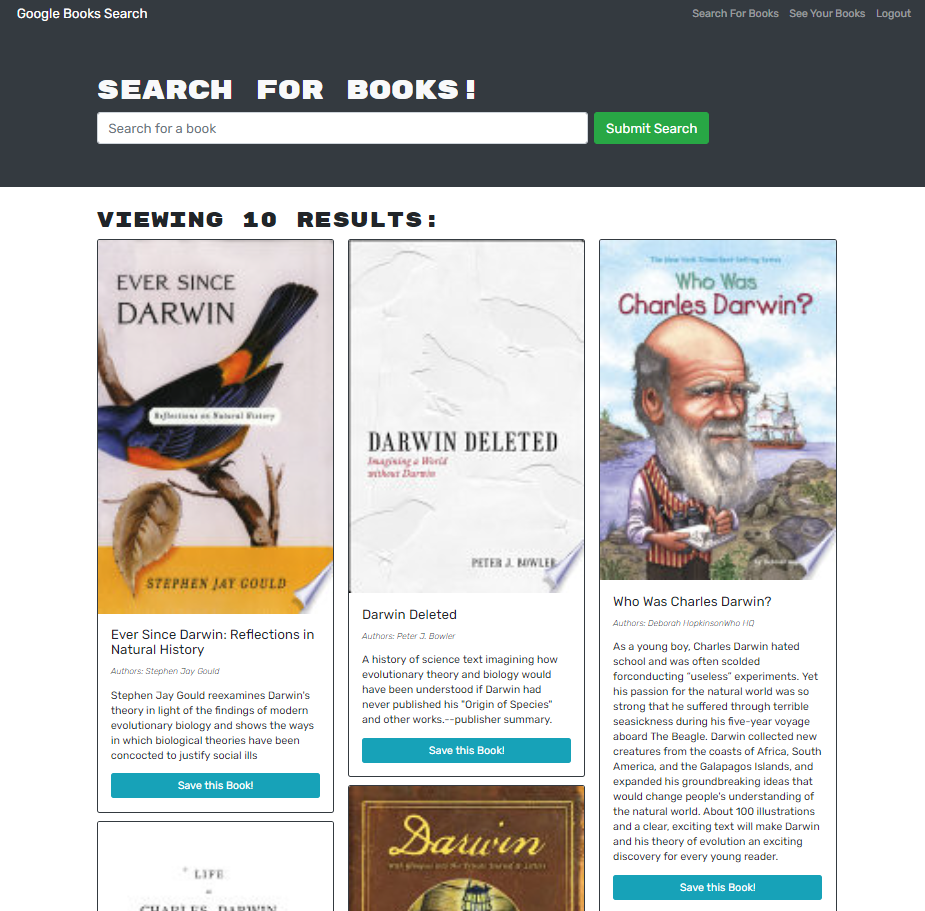

# <ins>Book Search Engine</ins>

## <ins>Description</ins>
This is a google book search that allows users to search for a book,save it to their account, and delete it from their account.  It uses a MongoDB database, Express.js, React, and Node.js to create a full stack application.
## <ins>Table of Contents</ins>
- [Installation](#installation)
- [Usage](#usage)
- [License](#license)
- [Features](#features)
- [Questions](#questions)

## <ins>Installation</ins>

Type `npm i` or `npm install` in the integrated terminal(if all the files do not install, attempt it again)

Run the application with `npm start`

## <ins>Usage</ins>

Link to deployed site:

https://calm-atoll-74130.herokuapp.com/

The application allows you to search for a book, with our without being logged in. However, if you choose to save the book, you must sign up/login first.

Upon searching for a book, a list will populate with a picute, the title, author and description of the book. If logged in, you can save the book to your account.

You are able to acces your saved books by navigating to the saved books page. You can delete a book from your account.

## <ins>License</ins>

This project is covered under MIT
## <ins>Features</ins>
Allows users to save books and delete them from their account

## <ins>Questions</ins>
Contact Budget Tracker at aabazary@gmail.com. Github link: https://github.com/aabazary
